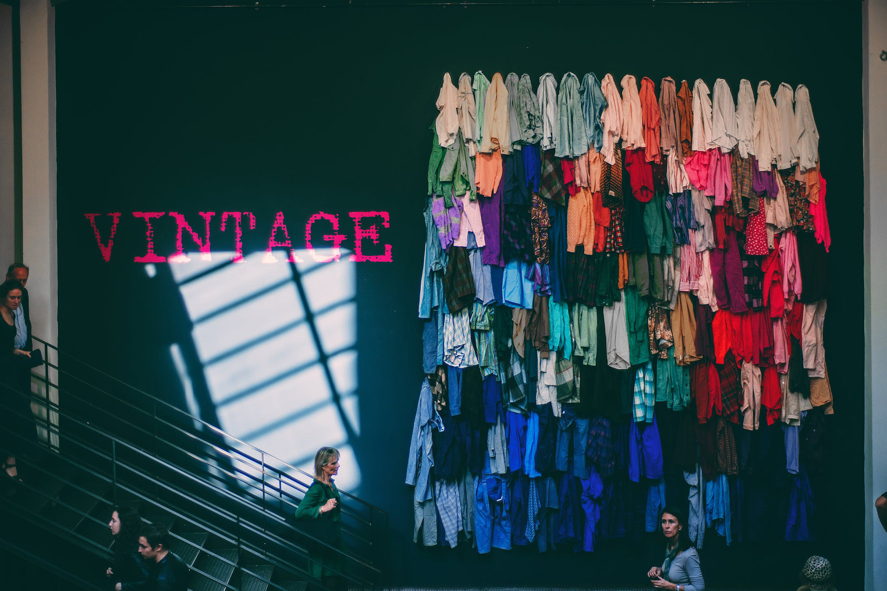
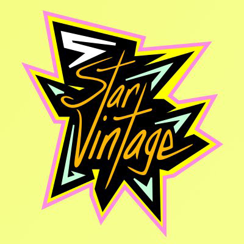
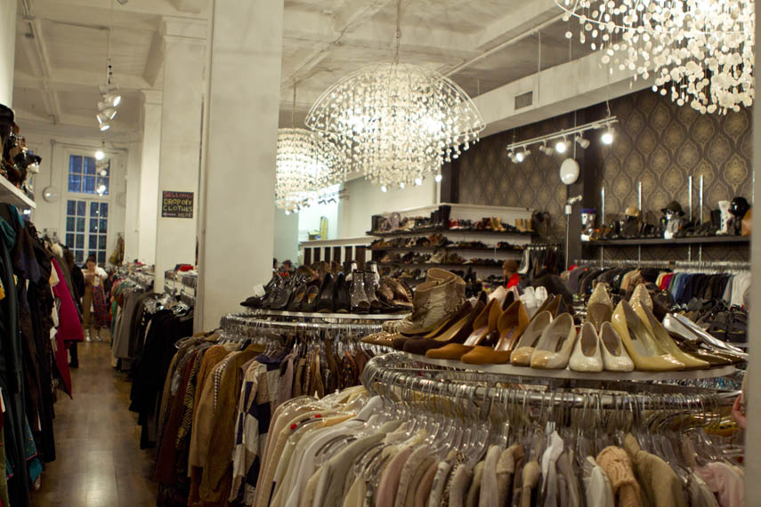

<link rel="stylesheet" href="https://unpkg.com/leaflet@1.7.1/dist/leaflet.css"
   integrity="sha512-xodZBNTC5n17Xt2atTPuE1HxjVMSvLVW9ocqUKLsCC5CXdbqCmblAshOMAS6/keqq/sMZMZ19scR4PsZChSR7A=="
   crossorigin=""/>

      <header class="blog-header py-3">
        

          

            <a class="text-muted" href="images/vintagefindslogo.png">Logo</a>
          

          

            <a class="text-muted" href="#">
              <svg xmlns="http://www.w3.org/2000/svg" width="20" height="20" viewBox="0 0 24 24" fill="none" stroke="currentColor" stroke-width="2" stroke-linecap="round" stroke-linejoin="round" class="mx-3"><circle cx="10.5" cy="10.5" r="7.5"></circle><line x1="21" y1="21" x2="15.8" y2="15.8"></line></svg>
            </a>
          

        

      </header>
  
  

        <nav class="nav">
          <a class="p-2 text-muted" href="#">Info</a>
          <a class="p-2 text-muted" href="#">Stores</a>
    </nav>
  

  <h2>Find Location</h2>
 

        

          
        

 
          
        

      
 
  
 <h2>Info</h2> 
  <h3>What's New</h3>
  
    
    

      

  
  

    <h5 class="card-title">A beginner’s guide to buying and selling secondhand fashion.</h5>
    
It’s easier than ever to resell high-end remorse buys and preloved items in Australia. But it takes a bit of effort to get reselling right

    <a href="#" class="btn btn-primary">See More</a>
  

  

    

    
    

      

  
  

    <h5 class="card-title">Why vintage fashion is the new smart investment.</h5>
    
If you've ever complained about the cost of new trainers, consider this. 

    <a href="#" class="btn btn-primary">See More</a>
  

  

      
    

  
  <h3>Support Small Business</h3>
  
    
    

      

  
  

    <h5 class="card-title">Selcouth</h5>
    
Hand picked vintage and streetwear.

    <a href="https://www.instagram.com/5starvintage/" class="btn btn-primary">More</a>
  

  

      
  
    
    

      

  
  

    <h5 class="card-title">5 Star Vintage</h5>
    
Online vintage store based in Los Angeles.

    <a href="https://www.instagram.com/selcouth.la/" class="btn btn-primary">More</a>
  

  

 
  

<!--   end info row -->
  
<h2>Stores</h2>  
  

    

      

  
  

    <h5 class="card-title">Beacon's Closet</h5>
    
Trendy resale outfit for vintage & modern clothing & accessories from mass brands to top designers.

  

    

    

    

      

  
  

    <h5 class="card-title">Buffalo Excahange</h5>
    
Hip chain that buys, sells, trades trendy vintage & used clothing & accessories for men & women.

  

    

   

    

      

  
  

    <h5 class="card-title">Goodwill NYNJ Store & Donation Center</h5>
    
Long-standing nonprofit chain with a range of pre-owned clothing, furniture, housewares & more.

  

    
 
     

    

      

  
  

    <h5 class="card-title">L Train Vintage</h5>
    
A family owned business that prides itself in bringing NYC the best thrift available. 

  

    

  

  
  

<!-- end container -->

      